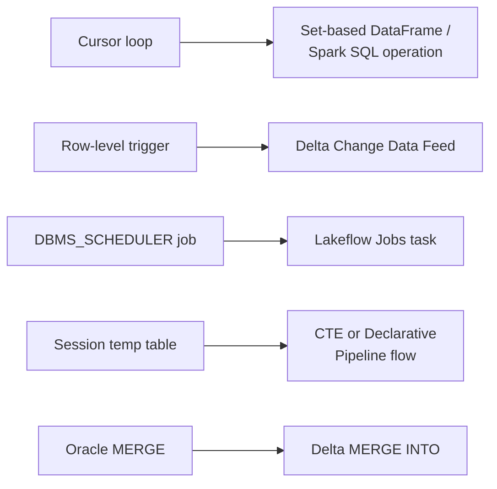

# Pattern Translation: Cursors, Triggers, Temp Tables, MERGE

The decomposition worksheet from the previous section ends with a "target pattern" column left
blank until the classification work is done. This section fills that column in for the five
patterns that account for most of what shows up inside a legacy procedure: cursors, triggers,
scheduled jobs, temp tables, and `MERGE` statements. Each lecture takes one legacy construct and
shows its concrete Databricks-native replacement, worked from real code rather than abstract
mapping rules -- closing with an anti-pattern gallery that catalogs the literal, line-by-line
translations experienced migration teams learn to avoid.

## Lectures

| # | Lecture | Est. Read |
|---|---------|-----------|
| 1 | [Cursor to Set-Based DataFrame Ops]({{ '/03-legacy-migration-to-databricks/08-pattern-translation-cursors-triggers-temp-tables-merge/cursor-to-set-based-dataframe-ops/' | relative_url }}) | 3 min read |
| 2 | [Trigger to CDC, DBMS_SCHEDULER to Workflows]({{ '/03-legacy-migration-to-databricks/08-pattern-translation-cursors-triggers-temp-tables-merge/trigger-to-cdc-dbms-scheduler-to-workflows/' | relative_url }}) | 3 min read |
| 3 | [Temp Table to CTE or Lakeflow Declarative Pipeline]({{ '/03-legacy-migration-to-databricks/08-pattern-translation-cursors-triggers-temp-tables-merge/temp-table-to-cte-or-lakeflow-declarative-pipeline/' | relative_url }}) | 3 min read |
| 4 | [Oracle MERGE to Delta Lake MERGE INTO]({{ '/03-legacy-migration-to-databricks/08-pattern-translation-cursors-triggers-temp-tables-merge/oracle-merge-to-delta-lake-merge-into/' | relative_url }}) | 3 min read |
| 5 | [SCD Type 2 the Lakehouse Way]({{ '/03-legacy-migration-to-databricks/08-pattern-translation-cursors-triggers-temp-tables-merge/scd-type-2-the-lakehouse-way/' | relative_url }}) | 3 min read |
| 6 | [Anti-Pattern Gallery and Pattern Cheat Sheet]({{ '/03-legacy-migration-to-databricks/08-pattern-translation-cursors-triggers-temp-tables-merge/anti-pattern-gallery-and-pattern-cheat-sheet/' | relative_url }}) | 3 min read |
| 7 | [Check Your Knowledge]({{ '/03-legacy-migration-to-databricks/08-pattern-translation-cursors-triggers-temp-tables-merge/check-your-knowledge/' | relative_url }}) | Quiz |

<!-- prevnext:start -->

---

| [&larr; Previous: Check Your Knowledge]({{ '/03-legacy-migration-to-databricks/07-the-procedure-autopsy-decomposing-pl-sql/check-your-knowledge/' | relative_url }}) | [Next: Cursor to Set-Based DataFrame Ops &rarr;]({{ '/03-legacy-migration-to-databricks/08-pattern-translation-cursors-triggers-temp-tables-merge/cursor-to-set-based-dataframe-ops/' | relative_url }}) |
|:---|---:|

<!-- prevnext:end -->

