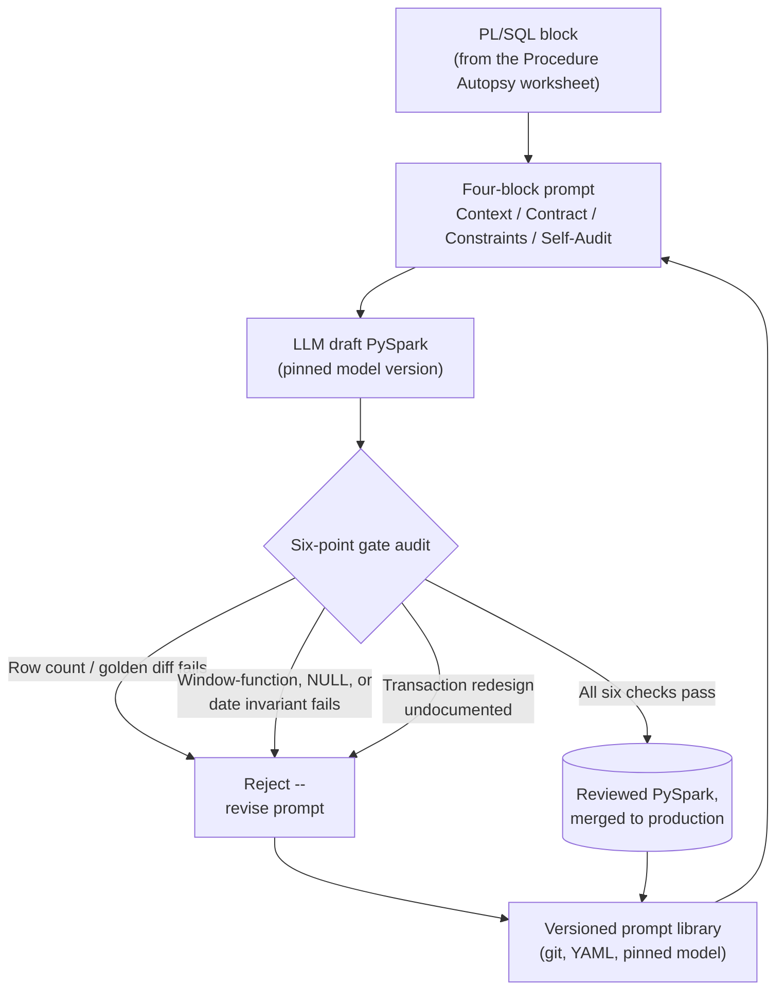

# AI-Assisted Migration: Lakebridge plus LLMs With a Human Gate

Lakebridge's transpiler handles the mechanical 80% of a migration; the Procedure Autopsy work in the last two sections handles the tangled procedural 20% that a rule-based converter can't touch -- and that's exactly the territory where teams now point a general-purpose LLM directly at a stored procedure for a first-draft PySpark translation. It's genuinely fast, and it is also the point in a migration where a plausible-looking wrong answer is easiest to ship by accident. This section builds the operating discipline that keeps that speed safe: prompts structured to close off the model's room to guess, three named failure patterns -- a window-function swap, a gallery of NULL/date/padding mismatches, and a transaction-boundary redesign -- worth recognizing on sight, and a versioned prompt library with a six-point audit gate that turns careful review into a repeatable checklist.

## Lectures

| # | Lecture | Est. Read |
|---|---------|-----------|
| 1 | [The Hybrid Model: 80% AI Speed plus 20% Human Accuracy]({{ '/03-legacy-migration-to-databricks/09-ai-assisted-migration-lakebridge-plus-llms-with-a-human-gate/the-hybrid-model-80-ai-speed-plus-20-human-accuracy/' | relative_url }}) | 3 min read |
| 2 | [Writing Effective PL/SQL to PySpark Transpilation Prompts]({{ '/03-legacy-migration-to-databricks/09-ai-assisted-migration-lakebridge-plus-llms-with-a-human-gate/writing-effective-pl-sql-to-pyspark-transpilation-prompts/' | relative_url }}) | 3 min read |
| 3 | [The Window-Function Hallucination]({{ '/03-legacy-migration-to-databricks/09-ai-assisted-migration-lakebridge-plus-llms-with-a-human-gate/the-window-function-hallucination/' | relative_url }}) | 3 min read |
| 4 | [Syntactically Valid, Semantically Wrong]({{ '/03-legacy-migration-to-databricks/09-ai-assisted-migration-lakebridge-plus-llms-with-a-human-gate/syntactically-valid-semantically-wrong/' | relative_url }}) | 4 min read |
| 5 | [The Transaction-Semantics Gap]({{ '/03-legacy-migration-to-databricks/09-ai-assisted-migration-lakebridge-plus-llms-with-a-human-gate/the-transaction-semantics-gap/' | relative_url }}) | 3 min read |
| 6 | [The LLM Prompt Library and Audit Checklist]({{ '/03-legacy-migration-to-databricks/09-ai-assisted-migration-lakebridge-plus-llms-with-a-human-gate/the-llm-prompt-library-and-audit-checklist/' | relative_url }}) | 3 min read |
| 7 | [Check Your Knowledge]({{ '/03-legacy-migration-to-databricks/09-ai-assisted-migration-lakebridge-plus-llms-with-a-human-gate/check-your-knowledge/' | relative_url }}) | Quiz |

<!-- prevnext:start -->

---

| [&larr; Previous: Check Your Knowledge]({{ '/03-legacy-migration-to-databricks/08-pattern-translation-cursors-triggers-temp-tables-merge/check-your-knowledge/' | relative_url }}) | [Next: The Hybrid Model: 80% AI Speed plus 20% Human Accuracy &rarr;]({{ '/03-legacy-migration-to-databricks/09-ai-assisted-migration-lakebridge-plus-llms-with-a-human-gate/the-hybrid-model-80-ai-speed-plus-20-human-accuracy/' | relative_url }}) |
|:---|---:|

<!-- prevnext:end -->

