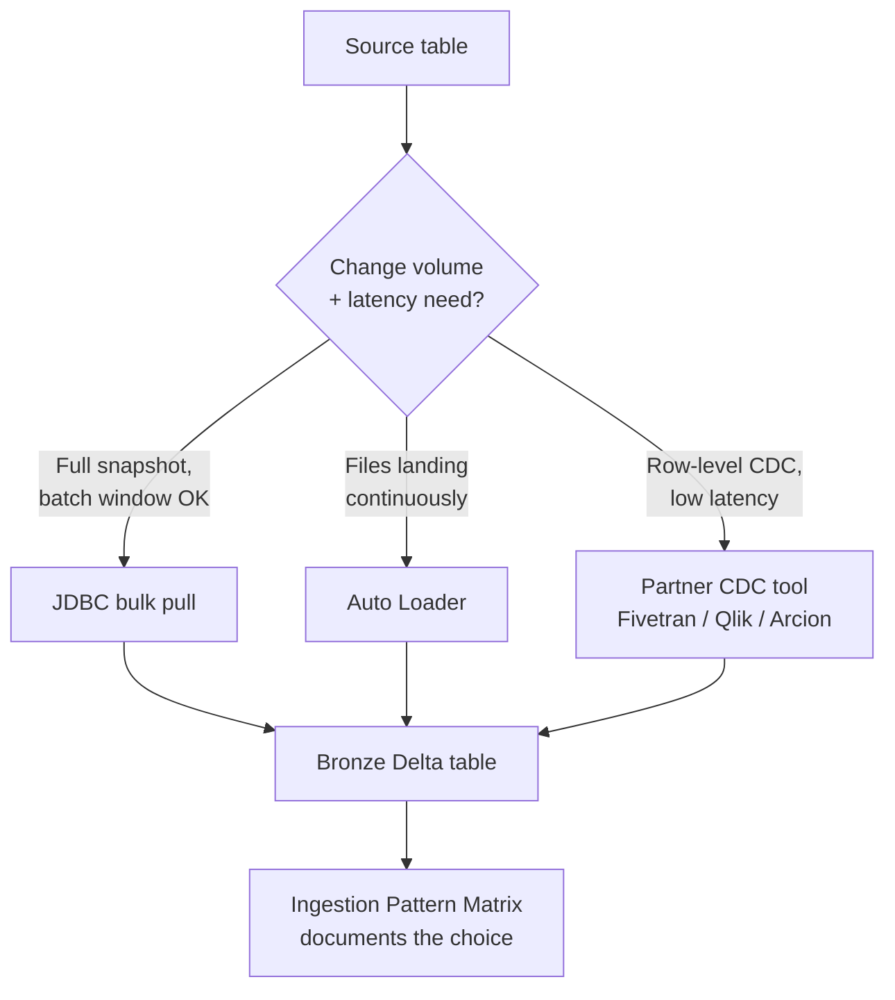

# The Ingestion Decision Tree

Every legacy nightly-batch job you've ever tuned made an ingestion decision without naming it as
one -- a schedule that fit the maintenance window, a JDBC connection sized to what the source
database could tolerate, a manifest file (or its absence) that determined whether a missing feed
failed loudly or corrupted silently downstream. Migrating that job to Databricks doesn't remove
those decisions; it just moves them from implicit habit to an explicit choice among batch vs.
streaming, JDBC bulk pull vs. Auto Loader, and build-it-yourself vs. a partner CDC tool. This
section works through that decision tree end to end, then collapses it into a single matrix you can
apply to any table in the migration inventory.

## Lectures

| # | Lecture | Est. Read |
|---|---------|-----------|
| 1 | [The Data Ferry: Schedule, Capacity, Manifest]({{ '/03-legacy-migration-to-databricks/10-the-ingestion-decision-tree/the-data-ferry-schedule-capacity-manifest/' | relative_url }}) | 2 min read |
| 2 | [Batch vs Streaming, Push vs Pull, Schema-on-Read vs Write]({{ '/03-legacy-migration-to-databricks/10-the-ingestion-decision-tree/batch-vs-streaming-push-vs-pull-schema-on-read-vs-write/' | relative_url }}) | 3 min read |
| 3 | [JDBC Bulk vs Auto Loader: The 10TB Table Decision]({{ '/03-legacy-migration-to-databricks/10-the-ingestion-decision-tree/jdbc-bulk-vs-auto-loader-the-10tb-table-decision/' | relative_url }}) | 2 min read |
| 4 | [Partner Tools: Fivetran, Qlik, Arcion for CDC]({{ '/03-legacy-migration-to-databricks/10-the-ingestion-decision-tree/partner-tools-fivetran-qlik-arcion-for-cdc/' | relative_url }}) | 2 min read |
| 5 | [The Ingestion Pattern Matrix]({{ '/03-legacy-migration-to-databricks/10-the-ingestion-decision-tree/the-ingestion-pattern-matrix/' | relative_url }}) | 3 min read |
| 6 | [Check Your Knowledge]({{ '/03-legacy-migration-to-databricks/10-the-ingestion-decision-tree/check-your-knowledge/' | relative_url }}) | Quiz |

<!-- prevnext:start -->

---

| [&larr; Previous: Check Your Knowledge]({{ '/03-legacy-migration-to-databricks/09-ai-assisted-migration-lakebridge-plus-llms-with-a-human-gate/check-your-knowledge/' | relative_url }}) | [Next: The Data Ferry: Schedule, Capacity, Manifest &rarr;]({{ '/03-legacy-migration-to-databricks/10-the-ingestion-decision-tree/the-data-ferry-schedule-capacity-manifest/' | relative_url }}) |
|:---|---:|

<!-- prevnext:end -->

