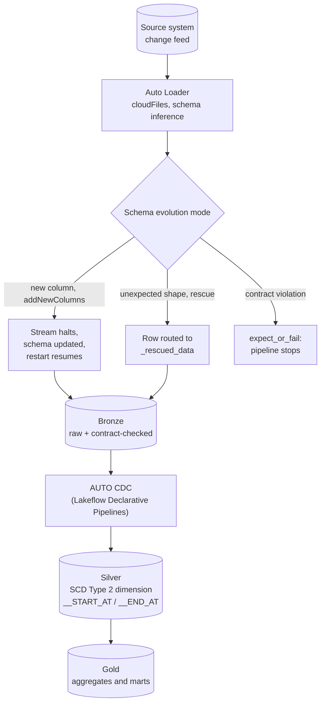

# CDC and Lakeflow Declarative Pipelines With Data Contracts

The Ingestion Decision Tree picked the mechanism; this section builds the pipeline that mechanism feeds. A legacy warehouse's nightly batch job assumed the source schema never moved -- an `ALTER TABLE ADD COLUMN` upstream was a change-control ticket someone reviewed before your ETL ever saw a new field. Streaming CDC removes that human checkpoint: a source system can rename, add, drop, or retype a column between one micro-batch and the next, and if nothing in the pipeline notices, the corruption is silent and it is already three layers deep -- bronze, silver, and gold -- before anyone downstream reports a broken dashboard.

This section covers the full path from a raw change feed to a governed dimension: how **Auto Loader** infers and evolves schema on ingest, how **Lakeflow Declarative Pipelines**' `AUTO CDC` collapses what used to be a hand-written `MERGE INTO` and effective-dating logic into a declarative SCD Type 2 target, and how a **data contract** enforced at the bronze boundary turns "the pipeline silently ate a bad batch" into "the pipeline stopped and told someone." It closes with the anti-pattern that undoes all of it -- streaming straight to silver without a bronze checkpoint -- and a contract template you can adapt for your own sources.

## Lectures

| # | Lecture | Est. Read |
|---|---------|-----------|
| 1 | [The CDC Architecture End to End]({{ '/03-legacy-migration-to-databricks/11-cdc-and-lakeflow-declarative-pipelines-with-data-contracts/the-cdc-architecture-end-to-end/' | relative_url }}) | 3 min read |
| 2 | [Auto Loader With Schema Inference and Evolution]({{ '/03-legacy-migration-to-databricks/11-cdc-and-lakeflow-declarative-pipelines-with-data-contracts/auto-loader-with-schema-inference-and-evolution/' | relative_url }}) | 4 min read |
| 3 | [Lakeflow Declarative Pipelines for SCD Type 2]({{ '/03-legacy-migration-to-databricks/11-cdc-and-lakeflow-declarative-pipelines-with-data-contracts/lakeflow-declarative-pipelines-for-scd-type-2/' | relative_url }}) | 3 min read |
| 4 | [Enforcing Schema at Bronze: Data Contracts]({{ '/03-legacy-migration-to-databricks/11-cdc-and-lakeflow-declarative-pipelines-with-data-contracts/enforcing-schema-at-bronze-data-contracts/' | relative_url }}) | 4 min read |
| 5 | [The Schema-Drift Death Spiral]({{ '/03-legacy-migration-to-databricks/11-cdc-and-lakeflow-declarative-pipelines-with-data-contracts/the-schema-drift-death-spiral/' | relative_url }}) | 3 min read |
| 6 | [Anti-Pattern: Direct-to-Silver and the Contract Template]({{ '/03-legacy-migration-to-databricks/11-cdc-and-lakeflow-declarative-pipelines-with-data-contracts/anti-pattern-direct-to-silver-and-the-contract-template/' | relative_url }}) | 4 min read |
| 7 | [Check Your Knowledge]({{ '/03-legacy-migration-to-databricks/11-cdc-and-lakeflow-declarative-pipelines-with-data-contracts/check-your-knowledge/' | relative_url }}) | Quiz |

<!-- prevnext:start -->

---

| [&larr; Previous: Check Your Knowledge]({{ '/03-legacy-migration-to-databricks/10-the-ingestion-decision-tree/check-your-knowledge/' | relative_url }}) | [Next: The CDC Architecture End to End &rarr;]({{ '/03-legacy-migration-to-databricks/11-cdc-and-lakeflow-declarative-pipelines-with-data-contracts/the-cdc-architecture-end-to-end/' | relative_url }}) |
|:---|---:|

<!-- prevnext:end -->

