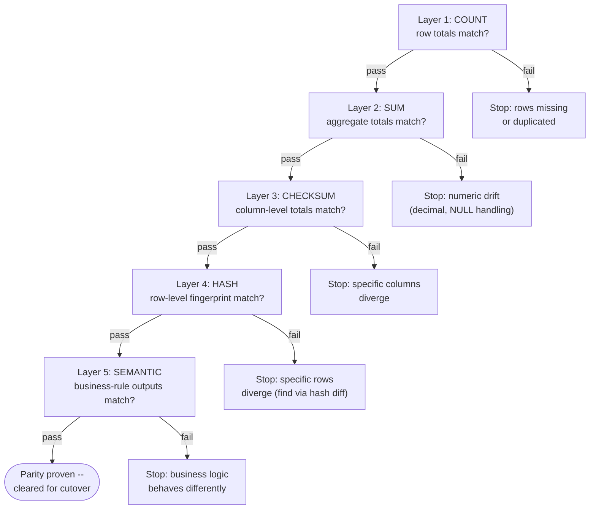

# The Reconciliation Stack: Proving Semantic Parity

A migration that ships without proof of parity isn't finished -- it's just unverified. Every prior section in this part moved data, translated schema, or rewrote procedural logic, and every one of those steps is a place a legacy Oracle semantic can quietly become a different Spark semantic: a tie-break `ORDER BY` that wasn't unique, a `NUMBER` column that summed differently than a `DECIMAL`, a `NULL`-handling rule that changed the shape of a join. Sign-off on a cutover has to rest on something stronger than "the row counts match," because row counts match plenty of migrations that are quietly, expensively wrong.

This section builds the reconciliation stack a migration team runs before anyone touches the cutover switch: a five-layer ladder from row **count** up through **sum**, **checksum**, **hash**, and finally **semantic** parity, each layer catching a class of error the one below it can't see. It works through two real incident shapes -- a `ROW_NUMBER` sort-order bug that misattributed millions in revenue, and a floating-point drift bug where Oracle's `NUMBER` and Spark's `DOUBLE` disagreed on a sum by cents that became dollars at scale -- and closes with how to set a tolerance threshold that separates real variance from noise instead of chasing every rounding difference to zero.

## Lectures

| # | Lecture | Est. Read |
|---|---------|-----------|
| 1 | [Row Counts Lie: Why Semantic Parity Is the Only Truth]({{ '/03-legacy-migration-to-databricks/12-the-reconciliation-stack-proving-semantic-parity/row-counts-lie-why-semantic-parity-is-the-only-truth/' | relative_url }}) | 3 min read |
| 2 | [The 5-Layer Stack: Count, Sum, Checksum, Hash, Semantic]({{ '/03-legacy-migration-to-databricks/12-the-reconciliation-stack-proving-semantic-parity/the-5-layer-stack-count-sum-checksum-hash-semantic/' | relative_url }}) | 3 min read |
| 3 | [The $4M Bug: ROW_NUMBER Sort-Order Differences]({{ '/03-legacy-migration-to-databricks/12-the-reconciliation-stack-proving-semantic-parity/the-4m-bug-row-number-sort-order-differences/' | relative_url }}) | 3 min read |
| 4 | [Floating-Point Variance: SUM(DECIMAL) Oracle vs Spark]({{ '/03-legacy-migration-to-databricks/12-the-reconciliation-stack-proving-semantic-parity/floating-point-variance-sum-decimal-oracle-vs-spark/' | relative_url }}) | 3 min read |
| 5 | [Tolerance Thresholds: Acceptable vs Real Variance]({{ '/03-legacy-migration-to-databricks/12-the-reconciliation-stack-proving-semantic-parity/tolerance-thresholds-acceptable-vs-real-variance/' | relative_url }}) | 3 min read |
| 6 | [Check Your Knowledge]({{ '/03-legacy-migration-to-databricks/12-the-reconciliation-stack-proving-semantic-parity/check-your-knowledge/' | relative_url }}) | Quiz |

<!-- prevnext:start -->

---

| [&larr; Previous: Check Your Knowledge]({{ '/03-legacy-migration-to-databricks/11-cdc-and-lakeflow-declarative-pipelines-with-data-contracts/check-your-knowledge/' | relative_url }}) | [Next: Row Counts Lie: Why Semantic Parity Is the Only Truth &rarr;]({{ '/03-legacy-migration-to-databricks/12-the-reconciliation-stack-proving-semantic-parity/row-counts-lie-why-semantic-parity-is-the-only-truth/' | relative_url }}) |
|:---|---:|

<!-- prevnext:end -->

