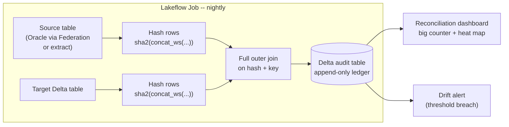

# Building the Reconciliation Engine

The previous section defined the five-layer reconciliation stack as a concept. This one builds it as a running system: a PySpark job that computes hashes at scale, a Delta audit table that keeps a permanent, queryable ledger of every parity check ever run, and a dashboard that turns that ledger into a single verdict a migration lead can read in five seconds. None of this is optional tooling -- without it, "we reconciled the data" means someone eyeballed a row count once, which is exactly the kind of unverified claim the prior section spent its time discouraging.

The section also makes a scheduling argument as much as an engineering one: reconciliation that only runs at the end of a migration finds its bugs at the worst possible time, when every defect is expensive and the cutover date is close. Running the same engine nightly from day zero of development turns reconciliation into a cheap, boring, continuous signal instead of a stressful pre-cutover fire drill -- and a script library built once, driven by config, is what makes running it against forty table pairs as easy as running it against one.

## Lectures

| # | Lecture | Est. Read |
|---|---------|-----------|
| 1 | [Architecting the Reconciliation Job]({{ '/03-legacy-migration-to-databricks/13-building-the-reconciliation-engine/architecting-the-reconciliation-job/' | relative_url }}) | 3 min read |
| 2 | [The PySpark Hash-Diff Implementation]({{ '/03-legacy-migration-to-databricks/13-building-the-reconciliation-engine/the-pyspark-hash-diff-implementation/' | relative_url }}) | 3 min read |
| 3 | [Reconciliation Dashboards: Making Parity Visible]({{ '/03-legacy-migration-to-databricks/13-building-the-reconciliation-engine/reconciliation-dashboards-making-parity-visible/' | relative_url }}) | 3 min read |
| 4 | [Start at Day 0, Not End of Project]({{ '/03-legacy-migration-to-databricks/13-building-the-reconciliation-engine/start-at-day-0-not-end-of-project/' | relative_url }}) | 3 min read |
| 5 | [The Reconciliation Script Library]({{ '/03-legacy-migration-to-databricks/13-building-the-reconciliation-engine/the-reconciliation-script-library/' | relative_url }}) | 3 min read |
| 6 | [Check Your Knowledge]({{ '/03-legacy-migration-to-databricks/13-building-the-reconciliation-engine/check-your-knowledge/' | relative_url }}) | Quiz |

<!-- prevnext:start -->

---

| [&larr; Previous: Check Your Knowledge]({{ '/03-legacy-migration-to-databricks/12-the-reconciliation-stack-proving-semantic-parity/check-your-knowledge/' | relative_url }}) | [Next: Architecting the Reconciliation Job &rarr;]({{ '/03-legacy-migration-to-databricks/13-building-the-reconciliation-engine/architecting-the-reconciliation-job/' | relative_url }}) |
|:---|---:|

<!-- prevnext:end -->

